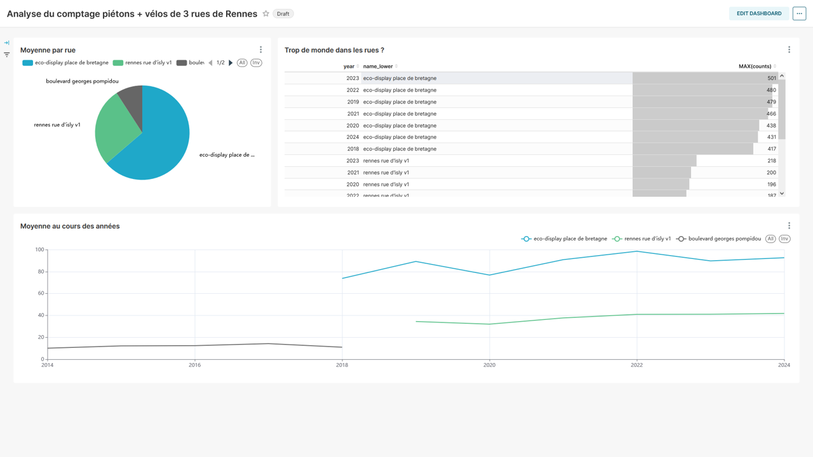

# Feuille de route Bachelor
## Prérequis
1. Avoir Docker d'installé sur la machine
2. S'assurer que les ports `3306`, `8088`
3. (Optionnel, pour l'administration de la bdd) Avoir le port `8080` ouvert

## Initalisation
1. cloner ce repo `git clone https://github.com/KyllianBeguin/SupDeVinciAtelierData.git`
2. Aller dans le repo
3. Lancer le scipt [get_superset_repo.sh](./get_superset_repo.sh)
    * Le script ne fonctionnera que si vous disposez de bash
    * Si cela n'est pas votre cas, veuillez cloner le repo d'[Apache Superset](https://github.com/apache/superset) dans un dossier appelé `DataViz`
4. Aller dans le dossier `Dataviz`
5. Lancer la commande `docker compose -f docker-compose-non-dev.yml up -d`
6. Aller sur la page `<IP-HOTE>:8088`
7. Entrer le nom d'utilisateur et le mot de passe (par défaut `admin` et `admin`)
8. Connecter la base de données mysql à Superset
   * Par défaut, le nom d'utilisateur est `root` et le mot de passe est `supdevinci`
   * Le port est celui par défaut : `3306`
9. Créer un nouveau tableau de bord ("Dashboard")

## Feuille de route
1. Faire venir les étudiants sur la page `<IP-HOTE>:8088`
2. Les connecter à la plateforme
3. Les diriger vers votre tableau de bord
   * Attention : Le tableau doit être vide !
4. Faire créer des graphiques ("Charts") par les étudiants
   * 3 graphiques à réaliser :
        1. Une visualisation du comptage moyen par année, selon les points de comptage
        2. Une moyenne totale par point de comptage
        3. Un tableau du comptage max par année, selon les points de comptage

## Exemple de réalisation
