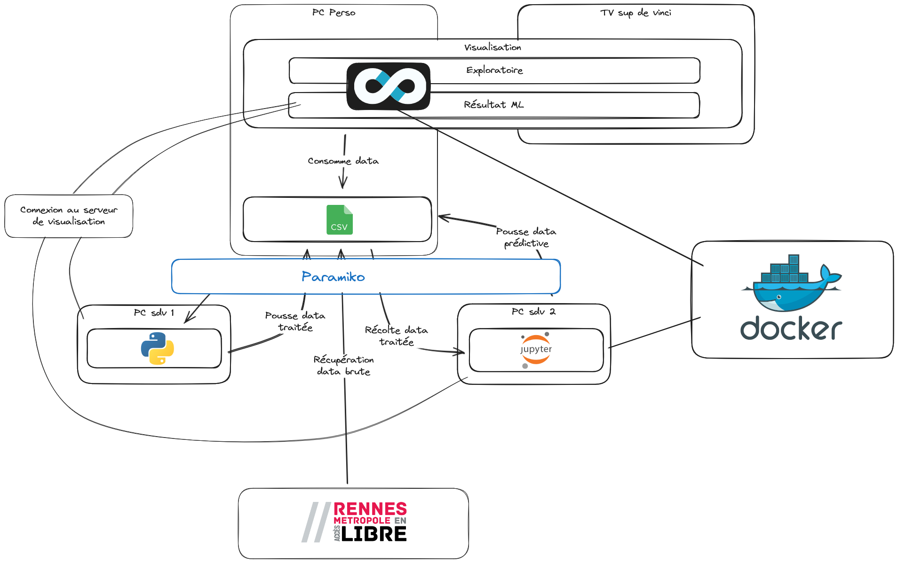

# Atelier Data du 27/03/2024

## Infrastructure
### Mise en place
1. Disposez d'une machine virtuelle  
    - De préférence, opter pour une machine hébergée chez un cloud provider.  
    - Cette VM servira pour les parties traitement de données / visualisation / machine learning. Vous devez vous assurer de disposer d'assez de ressources
    - Exemple : [D4s_v3 de chez Azure](https://learn.microsoft.com/en-us/azure/virtual-machines/dv4-dsv4-series)

2. Assurez-vous d'avoir Docker installé
    - [DOC - Comment installer Docker sur Ubuntu](https://docs.docker.com/engine/install/ubuntu/)
    - [DOC - Post-installation de Docker](https://docs.docker.com/engine/install/linux-postinstall/)
3. Allez dans le dossier `/DataEngineering`
4. Lancez la partie Data Engineering : `docker compose up --build -d`
5. Créez un environnement virtuel Python : `python3 -m venv venv`
    - Installer venv : `pip install virtualenv`
6. Activez l'environnement virtuel : `source venv/bin/activate`
7. Installez les dépendances : `pip install -r requirements.txt`
8. Lancez le flux de traitement de données : `python3 etl.py`
    - *Des logs apparaissent pour vous informer de l'activité du script*
    - Votre base de données est prête. Constulez là ici : `<IP-de-ma-VM>:8080` (mot de passe : `supdevinci` ; base : `atelierdata`)
9. Allez à la racine du projet
10. Lancez la commande `bash get_superset_repo.sh`
    - *Cela vous créer un dossier `DataViz`*
11. Allez dans le dossier `DataViz`
12. Lancez la commande `docker compose -f docker-compose-non-dev.yml up -d`
13. Allez sur la page web `<IP-de-ma-VM>:8088` et connectez-vous (utilisateur : `admin` ; mot de passe : `admin`)
14. Connectez la base de données mysql à Superset
    - Par défaut, le nom d'utilisateur de la base est `root` et le mot de passe est `supdevinci`
    - Le port est celui par défaut : `3306`
    - L'hôte est : `127.0.0.1`
    - La base est : `atelierdata`
    - Le nom d'utilisateur est : `root`
15. Initiez un dashboard et le sauvegarder
    - Il s'agit d'une coquille vide qui sera à alimenter par les étudiants.
16. Allez dans le dossier `/MachineLearning`
17. Lancez la commande `docker compose up --build -d`
18. Allez sur la page web `<IP-de-ma-VM>:8888` et connectez-vous
    - le token à entrer est : `my-token`
19. Dans cette application web, allez dans le dossier `/work`
20. Ouvrez le fichier `labML.ipynb`
21. Assurez-vous que l'ip de hôte de la base est bien celle de votre VM
    - Pour connaître l'ip de votre VM, tapez : `ip a`. Cela devrait vous proposer des ip, à tester.
    - Pour tester la connexion, lancez les cellules de code.
22. **Félicitation, votre atelier Data peut commencer !**

## Ateliers
### Atelier Bachelor
Objectif : Exposer des données visuellement, selon un cahier des charges  
Durée : 5 à 10 min  
Déroulé de l'atelier : cf [la feuille de route Bachelor](./FeuilleDeRouteBachelor.md)

### Atelier Mastère
Objectifs :  
1. Traiter la data selon un cahier des charge Machine Learning  
2. Prédire des données  
3. Visualiser les données prédites  

Durée : 20 min  
Déroulé de l'atelier : cf [la feuille de route Mastère](./FeuilleDeRouteMastere.md)  

## Autre
### Schématisation de l'infrastructure retenue

